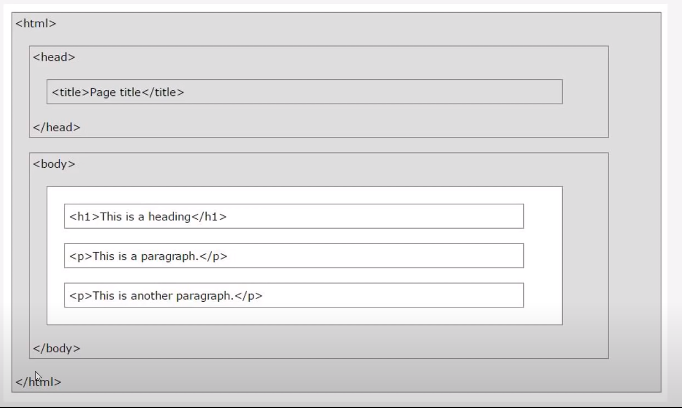
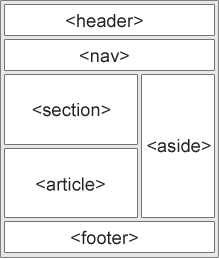

`2020-12-26, Intro to HTML5, 18:00`

Learn to become a modern frontend developer (roadmap.sh)
https://roadmap.sh/frontend/resources

HTML Crash Course For Absolute Beginners
https://www.youtube.com/watch?v=UB1O30fR-EE

- Hypertext Markup Language
- Not a programming language, it's markup
  - It has no logic like conditions (IFs)
- Index.html is always the root file
- `<tag>content</tag>`, it has start and end tags
- Some tags are used alone like ` `

- `<head>` is used by Google to gather information about the page
- `<!DOCTYPE html>` is the standard document format for HTML5, other HTML versions have different types
- [HTML5 Block & Inline elements](https://www.w3schools.com/html/html_blocks.asp 'HTML5 Block & Inline elements')
- There are Inline elements
  - Do not start a new line
  - Are organized vertically
  - Only take the width they need
  - ``,``,`<a>`
  - The `` element is an inline container used to mark up a part of a text, or a part of a document.
- There are Block elements
  - Start a new line
  - Are organized horizontally
  - Take all the width available
  - `
`,`<h1-h6>`,`
`,`<form>`
  - The `
` element is often used as a container for other HTML elements.

All HTML tags can have attributes
`<tag attribute="value">content</tag>`

HTML5 Semantic Tags

- `<article>`
- `<aside>`
- `
`
- `<figcaption>`
- `<figure>`
- `<footer>`
- `<header>`
- `<main>`
- `<mark>`
- `<nav>`
- `<section>`
- `
`
- `<time>`

HTML5 - Best Practices

- Always declare Document type: `<!DOCTYPE html>`
- Comments are used to explain things that code can't explain simply
- Use lowercase element names
- Close all HTML elements
- Use lowercase attributes
- Always quote attribute values
- Always specify alt for images
- Use style attribute to specify width/height of images with CSS
- Do not use spaces around equal signs
- Avoid long lines of codes
- Use blank lines and 2 spaces of indentation
- Always use the `<title>` element in the `<head>` section
- Always use <html>, <head>, and <body>
- Empty HTML elements can be closed, ` ` can be ` ` and also ` `
- Always use lang attribute inside `<html>`, and `<meta charset="UTF-8">` in `<head>`
- Always add `<meta name="viewport" content="width=device-width, initial-scale=1.0">`
- Small CSS rules can be written in one line
- Always use lower case file names
- Use proper extensions: .html, .css, .js
- Use entity names (like`&euro;`for &euro;) to avoid using reserved characters, or to add characters not found in your keyboard
  One symbol can be expressed in different ways, for example the Euro:  
- `
I will display &euro;
`
- `
I will display &#8364;
`
- `
I will display &#x20AC;
`
