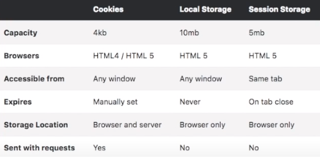

`2020-12-28, JavaScript Crash Course, 22:40`

JavaScript Crash Course for Beginners <br>
https://www.youtube.com/watch?t=2&v=hdI2bqOjy3c

- Multi-paradigm:
  - Object Oriented Code
  - Functional Code
  - Others...
- Scripting & Interpreted Language
- Runs on client/browser and server
  - Interactive elements (_client_)
  - Interacting with server (_node.js_)
- Very powerful client-side language


Initialize Variables

- `Var` > old way, global, can cause conflicts
- `Let` > ES6, assign and reassign values
- `Const` > ES6, constant, cannot reassign (but can make changes like make an array bigger/smaller)
  - Use const if you are sure you do not need to change the value
  - Use let for all other variables

Primitive Data Types

- No need to explicitly define types (= no static typing)
- Javascript assigns data types automatically
  - Strings, double or single quotes
  - Numbers, integer and float
  - Boolean, true/false
  - Null, empty (returns as object in `console.log` (typeof null.var)
  - Undefined
  - Symbol, ES6, uncommon use
  - Object
- Object, contains many different `key:value` pairs
  - Can also contain more objects with more `key:value` pairs
  - Arrays can also contain objects
  - Objects in Javascript are structured very similar to JSON (Javascript Object Notation)
  - Can covert objects to JSON with `JSON.stringify(object)`
- In JavaScript there are 5 different data types that can contain values:
  - `string`
  - `number`
  - `boolean`
  - `object`
  - `function`
- There are 6 types of objects:
  - `Object`
  - `Date`
  - `Array`
  - `String`
  - `Number`
  - `Boolean`
- And 2 data types that cannot contain values:
  - `null`
  - `undefined`


Old Concatenate

- String - plus sign - string
- `'My name' + variable`
  New Concatenate: Template string
- Use back tick: \`
- Use ${} to enclose the variable
- `` `My name is ${variable}` ```

Arrays

- Old constructor:
  - `age = new Array(1,2,3,4)`
- New direct array:
  - `age = [1,2,3,4]`
- You can mix data types inside arrays
- Add values to array
  - `Push`, add to end
  - `Unshift`, add to beginning
  - `Pop`, remove last
  - `IndexOf`, index of any value inside array
  - Many more

Loops

- For Loops
  - Variable start, condition, step
  - `let i = 0, i < 10, i++`
  - Works until condition is false
- While
  - Variables are set outside loop
  - `let i = 10`
  - `While (I < 10)`
  - Increment inside code (`i++`) or will run forever
- Loop arrays
  - `For (let i of array)`
  - This will loop through everything in array
- High order array method
  - `forEach`, loops each element in array
  - `map`, a loop that creates a new array
  - `filter`, create a new array with criteria
- Equal sign `=` vs `==` vs `===` (always use `===` to check)
  - `=` assigning values to a variable
  - `==` comparing two variables, but it ignores datatype
  - `===` comparing two variables, checks datatype
- Conditionals
  - `If, else if, else if, else`
  - Multiple conditions
    - Or = `||`
    - And = `&&`
    - Not = `!`
  - `Switch, case break, case break, default break`
- Ternary Operators, sort of a short hand condition
  - `?` = then
  - `:` = else
  - `const color = x > 10 ? 'red' : 'blue';`
- Functions
  - ` function name (param1, param2){}`
  - `function name (param1=value, param2)`
  - `Return name(param1, param2)`
- Arrow function
  - `const name = (param1, param2,…) => param1 + param2`
  - Everything after `=>` is returned

Object oriented programing
Constructor Functions - Old

- `function Name(property1, property2,…)`
- You can use that function to create a new object
- `const name2= new Name(param1, param2,…)`


Class Functions - Better

- Prettier way to do constructor functions


DOM manipulation (Javascript DOM Crash course, 4 videos)

- Document Object Model
- Tree structure of the whole document
- Window object, parent object of everything in the window
  - Like `alert`, `localStorage`, inner heigh/width, document (DOM)
  - Document property is what we manipulate

1. Selecting elements
   1. Single selectors (first find) 2. `document.getElementById` (old) 3. `document.querySelector` (new, best)
   2. Multiple selectors 5. `document.getElementsByClassName` (old) 6. `document.querySelectorAll` (new, best)
2. Manipulating elements with methods
   1. `.remove;`
   2. `.lastElementChild.remove;`
   3. `.firstElementChild.textContent = 'Hello';`
   4. `.children[1].innerText = 'Brad';`
   5. `.innerHTML = '<h4>Hello</h4>';` replace value inside tag, even adding a whole new tag inside another
   6. `.style.background = 'red';`
   7. `.appendChild`
   8. `.createElement`
   9. `.createTextNode`
3. Events
   1. `.addEventListener('click', <function_logic>)`
   2. `click`, `mouseover`, `mouseout`, `submit`, etc.

Storage


- LocalStorage and sessionStorage
  - localStorage.setItem('key','value'),
  - console.log(localStorage.getItem('key'));
  - localStorage.removeItem('key'),
  - localStorage.clear()
- Cookies
  - document.cookie = "key=value";
