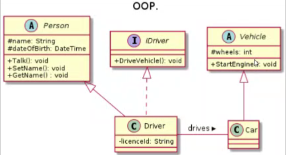

`2020-01-10, Intro a OOP, 19:00`

#### Paradigmas:
- Objeto = Object Oriented Programming
- Funcional = Functional Programming
- Imperativo = Imperative

#### Webinar con Roberto: Object Oriented Programming
- Abstraccion: extraer caracteristicas general de un ente, simplificar un ente a sus caracteristicas más elementales en el contexto, poner aparte las caracteristicas particulares y trabajar con sus caracteristicas generales.
	- Aves: vuelan? Plumas?
- Encapsulacion: formar un objeto autocontenido de informacion y funcionalidad necesaria para interactuar con otros elementos/objetos
	- Garantiza coherencia
	- Permite proteger la implementacion
	- Habilita el concepto de blackbox
		- No sé cómo funciona, solo sé que tiene un input y output
- Herencia: tomar caracteristicas y propiedades de un elemento, y usarlo en otro, establece una relacion "is a"
		- Aguila > "is a" > bird
	- Polimorfismo: un objeto puede tomar multiples formas. Capacidad de hacer la misma accion de diferentes maneras
		- Tomar las caracteristicas y comportamiento de varias entidades
		- Un driver puede ser de carro, avion, motocicleta
		- El operador + en javascript SUMA y CONCATENA, eso es polimorfismo tambien

- En Object Oriented Programming hay blueprints (como los planos de una casa), y casas de diferentes colores hechas con ese blueprint (instancias)
	- Asi funciona OOP, blueprints que definen diferentes instancias
	- Instanciar es tomar un clase abstracta, y darle caracteristicas especificas en una instacia
		- Class Car, brand: "";
		- Instance myCar "is a" car, brand: Audi;

#### Diagrama UML de clases
- Se usa para representar un objeto
	

- Una persona no necesariamente sabe manejar
- Hay que pasarle una instancia de Idriver, entonces la persona hereda la capacidad de manejar
- Y el carro tiene sus propiedades como wheels

1. Como saber que nivel de abstraccion tiene una clase para no sobre-abstraer?
2. Como saber cuando usar un paradigme?
	1. OOP: si te ves en la necesidad de describir muchas propiedades de algo, es una señal de usar OOP
3. Se puede aplicar mas de un paradigma en un proyecto?
	2. Si, ningun lenguaje se tranca a 1 solo paradigma, pero cada desarrollador decide que paradigmas usar para resolver un problema

Class: extensible program-code-template for creating objects, providing initial values for state (member variables) and implementations of behavior (member functions or methods).
