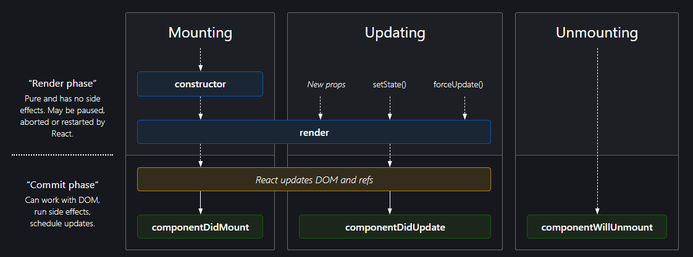

`2020-01-13, React, 20:00`

# React - http://reactjs.org
**React** is a JavaScript library for building user interfaces, created by facebook.
  - React is the view layer of an MVC application (Model View Controller)
  - Declarative, component-based.
  - React *native* is for native mobile applications using React.
  - React also streamlines how data is stored and handled, using `state` and `props`.

- React only updates when necessary
 - `ReactDOM` compares an elements and its children to the previous version, and only updates what is necessary to bring the DOM to the desired state.
 - Think about how UI should look at any given moment, instead of how to change it over time.
  - UI is just a series of snapshots one after the other.
 ```javascript
 // This example creates a whole new element every tick(),
 // but only the textnode is updated in the DOM by ReactDOM
 // because it is the only thing changing
 function tick() {
  const element = (
    <div>
      <h1>Hello, world!</h1>
      <h2>It is {new Date().toLocaleTimeString()}.</h2>
    </div>
  );
  // highlight-next-line
  ReactDOM.render(element, document.getElementById('root'));
}
setInterval(tick, 1000);
```

## Building blocks of React apps

Whenever conditions become too complex, it might be a good time to extract a component.
If a map() body is too nested, it might be a good time to extract a component.

### Elements
HTML elements written in JSX, basicaly descriptions of what you want to see rendered on screen.
An element is the most atomic unit of a React application.
  - Rendering logic is inherently coupled with other UI logic:
    - How events are handled, how state changes, how data is prepared for display
  - Instead of separating technologies in markup files and logic files, React separates *concerns* using components that contain both markup and logic.
  - React elements are **immutable**, once created, cannot be changed. Think of it as a frame in a movie, the only way to update the UI is to create a new elements and pass it to `ReactDOM.render()` or use **stateful components**.
### Components
Custom, reusable HTML elements, to quickly build user interfaces.
Always try to extract a component into its separate parts, having a palette of reusable components pays off. If a part of your UI is used several times (Button, Panel, Avatar), or is complex enough on its own (App, FeedStory, Comment), it is a good candidate to be extracted to a separate component.
    - Think of components like JavaScript functions: they accept arbitrary inputs (`props`) and return React elements based on those inputs.
    - Almost everything in React consists of components, which can be `class` components or `function` components. `class` components are declining in use.
    - Components must be **Capitalized** to avoid confusing them with *built-in* lowercase HTML tags.
    - Components can be inside components.
    - Notice how Class components need `render()` while function components simply `return()` directly.
      - If you are returning only 1 line, you can ommit the parenthesis `()`.
    - Notice that `return()` only returns one parent element, so it cannot return `<div></div><span></span>`, but it can return `<div><span></span></div>`.
      - If you need to `return()` two or more adjacent elements, you can use React Fragments.
  ```javascript
  // Class component - used to be the norm, now are declining in use.
  import React, {Component} from 'react'
  class App extends Component {
    render() {
      return (
        <div className="App">
          <h1>Welcome to React!</h1>
        </div>
      );
    };
  }
  ReactDOM.render(<App />, document.getElementById('root'));

  // Function component
  function App() {
    return (
      <div>
        <h1>Welcome to React!</h1>
      </div>
    );
  }
  ReactDOM.render(<App />,document.getElementById("root"));

  // Arrow function component
  const App = () => {
    return (
      <div>
        <h1>Welcome to React!</h1>
      </div>
    );
  }
  ```

### Fragments
A common pattern in React is for a component to return multiple elements. Fragments let you group a list of children without adding extra nodes to the DOM.
    - For example, you need to return multiple `<td>` into a `<table>`. You cannot return multiple adjacent elements so need to enclose them, but if you enclose them in `<React.Fragment></React.Fragment>` or the short syntax `<></>`.
    - Note that short syntax `<></>` does not support `keys` or `attributes`, you need to use `<React.Fragment>` for that.

  ```javascript
  //Fragment pattern
  render() {
    return (
      <React.Fragment>
        <ChildA />
        <ChildB />
        <ChildC />
      </React.Fragment>
    );
  }
  ```

### JSX
JavaScript as XML is a language extension to write HTML tags directly in the .js file.
- `className` is used instead of `class` for adding CSS classes, as `class` is a **reserved keyword** in JavaScript.
- Properties and methods in JSX are camelCase - `onclick` will become `onClick`.
- Self-closing tags *must* end in a slash - e.g. ``
- JavaScript expressions can also be embedded inside JSX using curly braces `{}`, including `variables`, `functions`, and `properties`.
  - `const name = 'Carlos'; const heading = <h1>Hello, {name}</h1>;`
- After compilation, JSX expressions become regular JS functions and objects.
  - `ReactDOM` escapes any values embedded in JSX, to prevent XSS.
  - `Babel` then compiles JSX down to `React.createElement()`

## Component Life-cycle and State
https://projects.wojtekmaj.pl/react-lifecycle-methods-diagram/



- Both props and state are plain JS objects
- Both props and state changes trigger a render update
- Both props and state are deterministic. If your Component generates different outputs for the same combination of props and state then you're doing something wrong.
 - If a Component needs to alter one of its attributes at some point in time, that attribute should be part of its `state`, otherwise it should just be a `props` for that Component.

| | _props_ | _state_ |
--- | --- | ---
Can get initial value from parent Component? | Yes | Yes
Can be changed by parent Component? | Yes | No
Can set default values inside Component?* | Yes | Yes
Can change inside Component? | No | Yes
Can set initial value for child Components? | Yes | Yes
Can change in child Components? | Yes | No
* Note that both props and state initial values received from parents override default values defined inside a Component.

`state` is optional. Since state increases complexity and reduces predictability, a Component without state is *preferable*. Even though you clearly can't do without state in an interactive app, you should avoid having *too many* Stateful Components.

### Component types
- **Stateless Component** — Only `props`, no `state`. There's not much going on besides the `render()` function and all their logic revolves around the `props` they receive. This makes them very easy to follow (and test for that matter). We sometimes call these *dumb-as-fuck* Components (which turns out to be the only way to misuse the F-word in the English language).
- **Stateful Component**— Both `props` and `state`. We also call these *state managers*. They are in charge of client-server communication (XHR, web sockets, etc.), processing data and responding to user events. These sort of logistics should be encapsulated in a moderate number of *Stateful Components*, while all visualization and formatting logic should move downstream into as many *Stateless Components* as possible.
  - You can use stateless components inside stateful components, and vice versa.

### Props
React handles data with properties, referred as `props`.
`props` (short for properties) are a Component's configuration, its options if you may. They are received from above and immutable as far as the Component receiving them is concerned.
- A Component cannot change its props, but it is responsible for putting together the props of its child Components.
  - When React sees an element representing a user-defined component, it passes JSX attributes and children to this component as a single object. We call this object `props`.
  - It is recommended to name props from the component point of view.
  - Reacts components must be pure, never attempt to change their inputs, and always return the same result for the same inputs. State allows React components to change their output over time in response to user actions, network responses, and anything else, without violating this rule.
In this example:
  1. We call `ReactDOM.render()` with the `<Welcome name="Sara" />` element.
  2. React calls the Welcome component with `{name: 'Sara'}` as the `props`.
  3. Our Welcome component returns a `<h1>Hello, Sara</h1>` element as the result.
  4. ReactDOM efficiently updates the DOM to match `<h1>Hello, Sara</h1>`.
```javascript
function Welcome(props) {
  return <h1>Hello, {props.name}</h1>;
}

const element = <Welcome name="Sara" />;
ReactDOM.render(
  element,
  document.getElementById('root')
);
```

### State
The state starts with a default value when a Component mounts and then suffers from mutations in time (mostly generated from user events). It's a serializable representation of one point in time—a *snapshot*.
A Component manages its own state internally, and has no business fiddling with the state of its children (besides setting an initial state). You could say the state is private, encapsulated.
- Since React components must never attempt to change their inputs, State allows React components to change their output over time in response to user actions, network responses, and anything else.
  - One way to update the UI is using `ReactDOM.render()`
  - State is similar to `props`, but it is private and fully controlled by the component.
  - A component may choose to pass its state down as props to its child components (called top-down or unidirection data-flow): `<FormattedDate date={this.state.date} />`


#### Three qualities about State
1. **Do Not Modify State Directly**, this will not re-render a component.
```javascript
// Wrong
this.state.comment = 'Hello';
// Correct
this.setState({comment: 'Hello'});
```
2. **State Updates May Be Asynchronous**, React may batch multiple `setState()` calls into a single update for performance.
```javascript
// Wrong
this.setState({
  counter: this.state.counter + this.props.increment,
});
// Correct
this.setState((state, props) => ({
  counter: state.counter + props.increment
}));
```
3. **State Updates are Merged**, When you call `setState()`, React merges the object you provide into the current state, but allows you to modify independent variables inside that object.
```javascript
 constructor(props) {
    super(props);
    this.state = { //setting both posts and comments in state
      posts: [],
      comments: []
    };
  }
    componentDidMount() {
    fetchPosts().then(response => {
      this.setState({
        posts: response.posts  //updating posts only
      });
    });

    fetchComments().then(response => {
      this.setState({
        comments: response.comments //updating comment sonly
      });
    });
  }
```
#### Handling Events
Similar to DOM events, using JSX syntax.
- To prevent default behavior in React. You must call `preventDefault` explicitly on the event that just happened.
- Reacts grabs the browser native `event` and wraps it in a browser agnostic `SyntheticEvent`.
  - This is completely abstracted, simply continue using `event` as always inside React.
- Notice in React you don't generally use `addEventListener`, instead you just provide a listener when creating an element like adding `onClick={this.functionName}` when creating a button.
```javascript
// in html
<button onclick="activateLasers()">Activate Lasers</button>
// in javascript with JSX
<button onClick={activateLasers}>Activate Lasers</button>
// adding listener when initially rendering the element
class Toggle extends React.Component {
  constructor(props) {
    super(props);
    this.state = {isToggleOn: true};
    this.handleClick = this.handleClick.bind(this);
    // This binding is necessary to make `this` work in the callback
    // Generally, if you refer to a method without () after it,
    // such as onClick={this.handleClick}, you should bind that method.
  }
  handleClick() {
    this.setState(state => ({ isToggleOn: !state.isToggleOn }));
  }
  render() {
    return (
      <button onClick={this.handleClick}>{this.state.isToggleOn ? 'ON' : 'OFF'}</button>
    );
  }
}
ReactDOM.render(<Toggle />,document.getElementById('root'));
// adding listener when initially rendering the element
```
#### Passing Arguments to event handlers
```javascript
<button onClick={(e) => this.deleteRow(id, e)}>Delete Row</button>
<button onClick={this.deleteRow.bind(this, id)}>Delete Row</button>
// The above two lines are equivalent, and use arrow functions
// and Function.prototype.bind respectively.
```

#### Conditionally Rendering a Component
You can use regular IFs `if (){} else if (){} else (){}`,
Short Circuits `condition && expression`, expression is never evaluated until condition is true
Conditional Ternary operator ` condition ? valueIfTrue : valueIfFalse;`
If you want a component to hide itself, have it `return null`.

#### React Toolkits
One of the most common ways of building react is using toolkits

**1. create-react-app**, for new single-page applications.
**2. Next.js**, for server-side rendered sites together with *Node.js*.
**3. Gatsby**, for static content.
**4. React Native**, for mobile native applications together with *Expo*.

### create-react-app
Exists to make the process of setting up a React application easier.
- package.json contain all of our project's dependencies
 - Testing libraries `jest-dom`, `react-testing-library`, `user-event`
 - `react` library to work in react
 - `react-dom` to render our react to the browser
 - `react-scripts` to bundle and server our code
- `scr` folder, with all files needed to write a `react` application
- `public` folder, used to place all production ready files

### Babel
Behind the scenes, babel is working to translate text that browsers do not understand, like JSX, and converting it into regular React.js or Vanilla JS code.

### React state with Hooks

### Array Destructuring
```javascript
const snacks = ["popcorn", "pretzel", "pineapple"];
const [xItem, yItem, zItem] = snacks
console.log(xItem); // "popcorn"
console.log(yItem); // "pretzel"
console.log(zItem); // "pineapple"
// you can ommit items
const snacks = ["popcorn", "pretzel", "pineapple"];
const [, , onlyOneItem] = snacks
console.log(onlyOneItem); // "pineapple"
// destructuring works with spread operator too
const snacks = ["popcorn", "pretzel", "pineapple"];
const [firstItem, ...others] = snacks
console.log(firstItem); // "popcorn"
console.log(others); // ["pretzel", "pineapple"]
```

### useState
In React, components will re-render if there's any change, it could be properties or state.
**Hook**, function to allows you to add functionality to a component
`useState` is a built-in hook to handle state changes.
Use state can be destructure to return current **state** and a function to **update state**.

```javascript
import React, { useState } from "react";
const [status, setStatus] = useState
```

### useEfect
Use it for code like `alert` and `console.log` that have nothing to do with the DOM. (Side-effects that aren't related to UI)
useEffect takes a function, and an option `dependency array []` at the end:
- If ommited, useEffect fires on every state change.
- If used as empty array `[]`, it fires once (per re-render?)
- If used with a value `[exampleVariable]`, it fires whenn that variable changes.

You can also fetch data data using useEffect, for example you can use the github api `api.github.com/users/CarlosGomez-dev`

### useReducer
It takes in the current states, and returns a new state.

### Deploying a React app
`build` script, `npm run build` creates a production build
`serve` to preview the build, `npm install -g serve` to install it globaly, then use `server -s build` to view your production build on `localhost:5000`
You can use different providers to host your production build:
- `https://www.netlify.com/pricing/`
- `https://www.heroku.com/pricing`
- `https://cloud.google.com/pricing`
- `https://azure.microsoft.com/en-us/pricing/details/app-service/windows/`

### GraphQL
Data loading predictably into react application