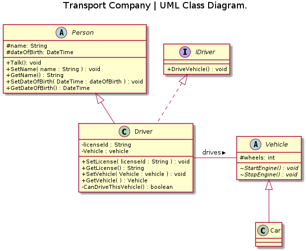

Base Class: `Dog`
Properties: `Color`, `eye color`, `height`, `lenght`, `weight`
Methods: `Sit()`, `LayDown()`, `Shake()`, `Come()`

Create Instance: `Bobby` "is a" `Dog`
Properties: `Yellow`, `brown`, `17in`, `35in`, `24lbs`
Methods: `Sit()`, `LayDown()`, `Shake()`, `Come()`

Section 1 : Name
Section 2 : Attributes = Variables inside class
Attribute: attribute type (like `int`, `void`)
Section 3 : Operations = Methods inside class
Method : return type (like `int`, `float`, `void`)
Can include paramethers inside `()` with their own types
Section 2 and 3 can have signature (`int`, `void`, etc)

`+` public
`-` private
`#` protected
`~` package
`/` derived
`underline` = static

parameters can be `in`, `out`, or `inout` (direction caller > method)
`in` = passed by caller to method
`out` = passed to caller by method
`inout` = possibly passed by caller, modified by method, and returned

Abstract Person
-
protected name as string
protected dateofbirth as datetime
-
public method talk(): void
public method setname (takes name as string): void
public method getname: string
public method setdateofbirth (takes dateofbirth as datetime): void
public method getdateofbirth(): datetime

Abstract IDriver
-
public method drivevehicle(): void

(C?) Driver
-
private licenseid as string
private vehicle as vehicle
-
public method setlicence (take licenseid as string): void
public method getlicense (): string
public method setvehicle (take a vehicle as vehicle): void
public method getvehicle(): vehicle
private method candrivethisvehicle(): boolean

Abstract Vehicle
-
protected wheels as int
-
package method startengine(): void
package method stopengine(): void

Car.
