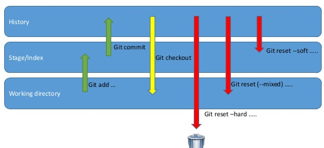

`2020-01-15 Git 19:30`

# Git

## View local commits

To view commit history on local copy, this might or might not be in sync with github
`git reflog`  
`git log`  
`git log --oneline`  

## Delete Local Branch

`git branch -d [branch_name]`

## Delete brach on github and reupload local as new branch

`git push origin :[branch_name]`, notice the `<empty>:[branch_name]`, this will push `<emptyness>` to github 
`git branch -m [branch_name] [new_brach_name]`, if you want to rename local brach before pushing 
`git push origin [branch_name]`, push local branch to github 

## Check git status on all sub-folders

`find . -type d -name '.git' | while read dir ; do sh -c "cd $dir/../ && echo -e \"\nGIT STATUS IN ${dir//\.git/}\" && git status -s" ; done`

## Remove commit from github

`git reset --hard [sha1]` choose the commit you want to be on, this downgrades local copy
`git reset [sha1]` choose the commit you want to be on, this downgrades local copy

- The difference between them is to change or not change head, stage (index), working directory.
  - `git reset --hard` will change **head**, **index/stage** and **working directory**.
  - `git reset --soft` will change **head** only. No change to _index/stage_, or _working directory_.

`git push origin -f` this pushes the downgraded copy to github

## Remove commits from local

`git fetch --all` grab latest github commits
`git reset --hard origin/[branch_name]` downgrade your local "main" branch to whatever github has

## Delete commit history, keep latest code version.

Checkout  
`git checkout --orphan latest_branch`  
Add all the files  
`git add -A`  
Commit the changes  
`git commit -am "Initial Commit"`  
Delete the branch  
`git branch -D main`  
Rename the current branch to main  
`git branch -m main`  
Finally, force update your repository  
`git push -f origin master`  

## Backup and Restore GPG

### Backup

Open `git bash` in `%userprofile%\.gnupg`  
`gpg --armor --export > pub-backup.asc`, export public cert  
`gpg --armor --export-secret-keys > priv-backup.asc`, export secret cert (need passphrase) 
`gpg --armor --export-ownertrust > trust-backup.asc`, export ownertrust  
Compress and back the whole `.gnupg` folder  

### Restore

Decompress archive and place `.gnuph` folder in `%userprofile%`  
open `git bash` in `%userprofile%\.gnupg`  
`gpg --import < priv-backup.asc`, import private cert (need passphrase) 
`gpg --import < pub-backup.asc`, import public cert  
`gpg --import-ownertrust < trust-backup.asc`, import ownertrust  

## Delete Brach from local and remove

`git branch -d [branch_name]`
`git push origin --delete [branch-name]`
