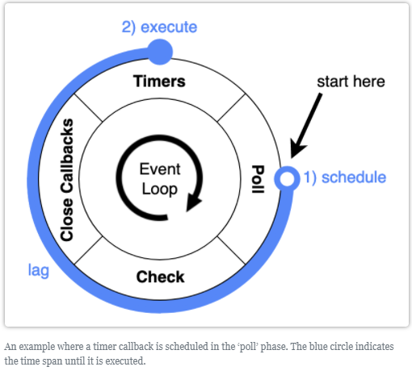

`2020-01-18, Node.js Event Loop`

# Node.js

https://nodejs.org/en/about/
Node.js is a JavaScript runtime built on Chrome's V8 JavaScript engine.
As an _asynchronous_, _event-driven_ JavaScript runtime, Node.js is designed to build scalable network applications.

- Node.js is single-threaded. This means that all operations execute in a single thread. In other words, Node.js applications have a single call stack.
- Node.js enters the event loop after executing the input script. Node.js exits the event loop when there are no more callbacks to perform. This behavior is like browser JavaScript — the event loop is hidden from the user.
- Node.js being designed without threads doesn't mean you can't take advantage of multiple cores in your environment. _Child processes_ can be spawned by using our `child_process.fork()` API, and are designed to be easy to communicate with. Built upon that same interface is the _cluster module_, which allows you to share sockets between processes to enable load balancing over your cores.

## Event Loop

Fundamental concept to perform asynchronous processes and non-blocking I/O operations, by offloading to the system kernel when possible. The kernel then executes in the background and return the result to node, creating a callback for the poll queue.

When writing code, monitor event loop metrics like `loop latency`, `callback computation score`, and `execution time`

| Phases | [Heynode](https://heynode.com/tutorial/how-event-loop-works-nodejs)<sup>[1]</sup> | [Node.js](https://nodejs.org/en/docs/guides/event-loop-timers-and-nexttick/)<sup>[2]</sup> | Notes - Each phase has a **FIFO**[<sup>[2]</sup>](https://nodejs.org/en/docs/guides/event-loop-timers-and-nexttick/) queue of callbacks.                                                                                                                                                                                                                                                                                                                                                            |
| ------ | --------------------------------------------------------------------------------- | ------------------------------------------------------------------------------------------ | --------------------------------------------------------------------------------------------------------------------------------------------------------------------------------------------------------------------------------------------------------------------------------------------------------------------------------------------------------------------------------------------------------------------------------------------------------------------------------------------------- |
| 1      | Timers pool/queue                                                                 | timers                                                                                     | Execute callbacks from expired timers: `setTimeout()` and `setInterval()`                                                                                                                                                                                                                                                                                                                                                                                                                           |
| 2      | I/O callbacks                                                                     | pending callbacks                                                                          | Execute I/O callbacks deferred/postponed from the previous event loop.                                                                                                                                                                                                                                                                                                                                                                                                                              |
| 3      | Idle / Preparation                                                                | idle, prepare                                                                              | Only used internally by Node.js                                                                                                                                                                                                                                                                                                                                                                                                                                                                     |
| 4      | I/O polling                                                                       | poll                                                                                       | Retrieve new I/O events; execute I/O related callbacks, Node.js will **block** here when appropriate.<br>- e.g. `fs.readFile()` completed/errored, any incoming connections, data, etc.<br><hr>This is also when our JavaScript code is run.[<sup>[1]</sup>](https://heynode.com/tutorial/how-event-loop-works-nodejs)<br>The code may execute immediately, or it may add something to any event loop queue.<br>- e.g. set a timer `setTimeout()`, send I/O operations to OS kernel `fs.readFile()` |
| 5      | Callbacks execution                                                               | check                                                                                      | Execute callbacks from `setImmediate()`                                                                                                                                                                                                                                                                                                                                                                                                                                                             |
| 6      | Close events callbacks                                                            | close callbacks                                                                            | Execute close callbacks, e.g. `process.exit()` and `socket.on('close', ...)                                                                                                                                                                                                                                                                                                                                                                                                                         |

- Behind the scenes, there are C/C++ APIs that provide asynchronous input/output (I/O), and interaction with the operation system (OS), that allow code execution similar to multithreading without the same memory shortcomings. The _Event Loop_ was implemented to assist with the interactions between these asynchronous components and the main application thread. The Event loop is implemented as part of the **libUV library** that provides _cross-platform asynchronous_ I/O in Node.js.
  - **libUV** prevents _phase 4: poll_ from starving the event loop by setting a hard maximum of events before it stops polling for more (the limit is OS dependent).
  - Some phases are executed by the Event Loop itself, but for others the main tasks are passed to the asynchronous C++ APIs.
    - Expensing Node.js API operations:
    - Encryption `crypto_crypto`
    - Compression `zlib_zlib`
    - File system `fs_file_system`
    - Child process `child_process`

### Terms and Definitions

- **Process**: the top-level runtime container of the application during the execution. The process starts when the application starts execution (e.g. `node index.js`). It has a dedicated memory pool and can have multiple threads.
- **Thread**: a coding sequence that resides within the process and uses its memory pool.
- **Call Stack**: a stack data structure that holds the information of called functions that allows transfer of the application control from these functions to the main process after code inside the functions has been executed.
  - Call stack records where in the program execution we are at any given time.
  - Callstack operates as a queue, where a processing-heavy function might block the stack until completed, which also blocks user interaction.
- **Multithreading**: architectural concept that allows a single process (application container) to have multiple coding sequences that can be executed concurrently within a single main process.
  - Multithreading contributes to software complexity as threads need to communicate between each other to stay synchronized with the main thread and other threads.
  - Multithreading can introduce a _Race Condition_, a bug that happens due to lack of synchronization between two threads, and our inability to know which thread will access a shared variable first.
- **Memory Pool**: a data buffer that is dedicated to the particular process during its runtime.
- **Tick**: the time frame that outlines one full Event Loop iteration from start to finish of all 6 phases.
- **Timer**: a function that executes code after a set period of time.
- **I/O**: Input/Output, any task that involves external hardware -- file system, network operations, etc.

### Phases - macro-tasks

The event loop starts the moment Node.js executes your application entry point (e.g. an _index.js_ file)

- Each phase has a FIFO queue of callbacks.
- The event loop enters any given phase, performs any pending operations specific to that phase, then executes callbacks in that phase's queue.
  - All pending operations are executed, but callbacks have a limit, if that limit is reached, the rest of the callbacks are left waiting for the next tick.
  - Any of those operations may schedule _more_ operations, for example you can be processing events in the poll phase, while the kernel is dropping more callbacks to the poll queue, so it's possible that _long running callbacks can allow the poll phase to run much longer than a timer's threshold_.

#### **1. Timers**

A timer specifies the **threshold** _after which_ a provided callback _may be executed_, so timers are **not exact**. Timers callbacks will be scheduled as soon as possible **after** timer has expired, and OS scheduling or running other callbacks can _delay them even more_.
Technically, the _poll phase_ controls when timers are executed (see example below).

- These functions are `setTimeout()` and `setInterval()` provided by the core _timers module_. The _event loop_ also updates its own time here.
- Both take a _callback_ function, a _delay_, and optional _arguments_ to pass to the callback after the delay.
  - The difference is that `setInterval()` has a repeat flag to repeat the timer, this is how servers stay _alive_ waiting for requests.
- Here the event loop compares its own time with the timer that has the shortest time to see if it's elapsed, so it can move the timer's callback to the callback queue
- This is the reason why a timer's wait time is not exact, it is in fact the _minimum_ wait time before going into the callback queue, then it has to wait in the callback queue until the callstack is cleared.

```javascript
import { readFile } from 'fs';
// const fs = require('fs');

function someAsyncOperation(callback) {
  // Assume this readFile takes 95ms to complete
  readFile('/path/to/file', callback);
}

const timeoutScheduled = Date.now();

setTimeout(() => {
  const delay = Date.now() - timeoutScheduled;
  console.log(`${delay}ms have passed since I was scheduled`);
}, 100);

// this is the callback to someAsyncOperation
// so someAsyncOperation(95ms) + callback(10ms) = 105ms
someAsyncOperation(() => {
  const startCallback = Date.now();
  // this while takes 10ms...
  while (Date.now() - startCallback < 10) {
    /*do nothing*/
  }
});
```

| Event Loop 1      | Timeline  | Note                                                                                                                                                                                           |
| ----------------- | --------- | ---------------------------------------------------------------------------------------------------------------------------------------------------------------------------------------------- |
| timer             | 0ms       | there are no callbacks from expired times                                                                                                                                                      |
| pending callbacks | 0ms       | there are no deferred/postponed I/O callbacks                                                                                                                                                  |
| idle, prepare     | 0ms       | internal Node.js operations                                                                                                                                                                    |
| poll              | 0ms       | our js code is running[<sup>[1]</sup>](https://heynode.com/tutorial/how-event-loop-works-nodejs):<br>- send the I/O operation to the kernel<br>- register the timer of 100ms for `console.log` |
|                   | 0ms       | **poll** queue is empty                                                                                                                                                                        |
|                   | 0ms       | **poll** will wait 100ms for that timer to complete                                                                                                                                            |
|                   | 95ms      | async I/O operation completes, and its callback is added to the **poll queue**                                                                                                                 |
|                   | 95ms      | Callback is executed right away in **poll**                                                                                                                                                    |
|                   | 105ms     | **poll** is done with callback and checks timers again                                                                                                                                         |
|                   | 105ms     | there's 1 timer of 100ms expired, so **poll** ends                                                                                                                                             |
| check             | 105ms     | there are no `setImmediate()` callbacks on queue                                                                                                                                               |
| close callback    | 105ms     | there are no pending close callbacks on queue                                                                                                                                                  |
| **Event Loop 2**  | **105ms** | **next loop starts**                                                                                                                                                                           |
| timer             | 105ms     | timer of 100ms for `console.log` is expired, callback is executed at 105ms.                                                                                                                    |

#### **2. I/O Callbacks**

Phase of non-block I/O operations. Any asynchronous I/O operation returned from the OS with a callback (completed/errored) is processed in this phase, for example TCP error of ECONNREFUSED.

- I/O operations are Asynchronous by default and have Synchronous counterparts, for example `fs.readFile()` vs `fs.readFileSync()`

#### **3. Idle / Preparation**

Housekeeping phase, used to gather information, planning what needs to be executed during the next tick.
There is no mechanism to directly influence this phase.

#### **4. I/O polling v1**

Optional phase, may not happen on every tick.

- There is an internal `setTimeout()` set at the beginning of this phase, and its delay depends on the state of the application
- Here all the JavaScript code is executed, from the beginning of the file, it may be code that executes immediately, or a timer for another tick. All callbacks in this phase are called _synchronously_. This is the phase that can _slowdown_ execution if any callback is slow/heavy.
- If there are any 'setImmediate()` timers scheduled, this phase is skipped to go to _phase 5: check_.
- If there are no timers and no function, the application waits for callbacks to be added to the callback queue until the internal `setTimeout()` expires.

#### **4. I/O polling v2**

1. Calculate how long it should **block** and poll for I/O
2. Check if there are any expired timers and wrap back to the timer's phase to execute those timers
3. If no expired timers, process events in its **poll** queue, iterate through poll callback queue executing FIFO synchronously until the queue is empty OR the system hard limit is reached
4. If no expired timers, and no callbacks in poll queue, check for `setImmediate()` to end **poll** and move into **check**
5. If no expired timers, no callbacks in poll queue, no `setImmediate()` callbacks, then even loop waits for callbacks to be added to poll queue to execute them immediately (how long does it wait?), and also check for expired timers to wrap back to **timers**

#### **5. check / `setImmediate()` callbacks**

`setImmediate()` is a special timer that uses a libUV API to schedule callbacks that execute after **poll phase**, during **check phase**.
If the poll phase becomes idle and there are `setImmediate()` callbacks, poll will end and continue to the check phase rather than waiting for more poll events.

#### **6. Close events**

Execute any close events, for example a close event of web socket callback `socket.destroy()`, or `process.exit()` execution. This is where the state of the application is cleaned.

### Phases - Important Details

#### `process.nextTick()`

`process.nextTick()` is not part of the event loop, instead the `nextTickQueue` is always processed after the current operation in any phase. _Operation_ here means transition from the C/C++ handler to handling the JavaScript code that comes next.

- Any time `process.nextTick()` is called, all callbacks and arguments attached to it are resolved **before** the event loop continues, this means it's possible to starve the event loop wirh recursive `process.nextTick()` calls.
- This means that we can garantee `process.nextTick()` will always run its callbacks **after** user's code and **before** the event loop proceeds.
- This is because JS call stack is allowed to unwind then immediately execute the `process.nextTick()` which means it allows recursive calls to `process.nextTick()` without reaching a `RangeError: Maximum call stack size exceeded from v8.`

```javascript
let bar;
// this seems to be asynchronous, but calls callback synchronously
function someAsyncApiCall(callback) {
  callback();
}
// the callback is called before `someAsyncApiCall` completes.
someAsyncApiCall(() => {
  // since someAsyncApiCall hasn't completed, bar hasn't been assigned any value yet
  console.log('bar', bar); // undefined is returned by the unassigned bar
});
bar = 1;

// In contrast, with process.nextTick()
let bar;
// using process.nextTick here allows someAsyncApiCall to run completely
// this allows all variables and functions after it to be initialized before the callback
function someAsyncApiCall(callback) {
  process.nextTick(callback);
}
// and also has the advantage that process.nextTick will not allow event loop to continue
// so the callback is still resolved before the event loop
someAsyncApiCall(() => {
  console.log('bar', bar); // 1 is returned, as variable was initialized
});
bar = 1;
```

#### `setImmediate()` vs `setTimeout()`

setImmediate() is designed to execute a script once the current poll phase completes.
setTimeout() schedules a script to be run after a minimum threshold in ms has elapsed.
If both are called from within the main module, the timming is non-deterministic

- Non-deterministic algorithm is an algorithm that, even for the same input, can exhibit different behaviors on different runs
  If both are called within an I/O cycle, the immediate callback is always executed
- The main advantage is `setImmediate()` will always be executed before any timers if scheduled within an I/O cycle, independently of how many timers are present. (why? and does that include timers outside the I/O cycle?)

#### `process.nextTick()` vs `setImmediate()`

`process.nextTick()` fires immediately on the same phase.
`setImmediate()` fires on the following iteration/tick of the event loop

Promises?

### Event loop lag

Event loop lag measures the time span between the scheduling of a callback and its execution



Measure event loop lag: this functions sets a timer for itself, and does this recursively with no stop action, so it will callback to itself infinitely, and will run once per event loop thanks to the `setTimeout()`.

- We can see that an event loop doing nothing but a single `console.log()` takes around 0.2ms, you can use this a Node.js baseline for an empty event loop.
- If your program reaches ~30ms, it's worth investigation.
  - If it ever reaches ~100ms, there is something wrong.

```javascript
function measureLag(iteration) {
  const start = process.hrtime();
  setTimeout(() => {
    const lag = process.hrtime(start);
    console.log(`Loop ${iteration} took\t${lag} ms`);
    measureLag(iteration + 1); // Recurse
  });
}
measureLag(1);
/*
 * Loop 1 took     0,1455500 ms
 * Loop 2 took     0,2222000 ms
 * Loop 3 took     0,2532500 ms
 * Loop 4 took     0,15049500 ms
 * Loop 5 took     0,15328000 ms
 * Loop 6 took     0,15025500 ms
 * Loop 7 took     0,15178300 ms
 * Loop 8 took     0,13848200 ms
 * Loop 9 took     0,139200 ms
 * Loop 10 took    0,12498400 ms
 */
```
