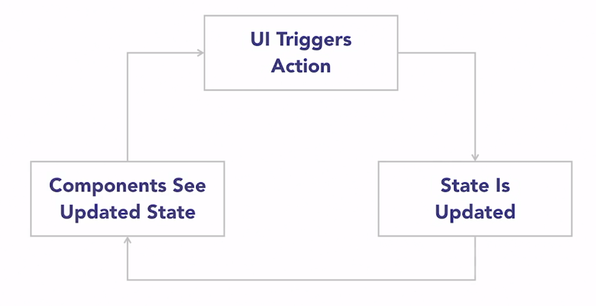
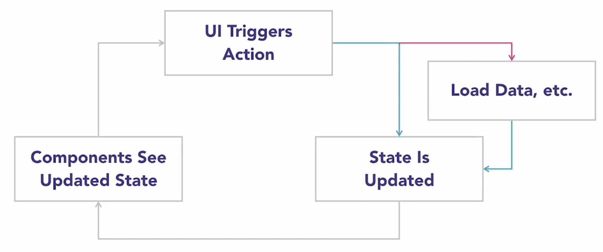
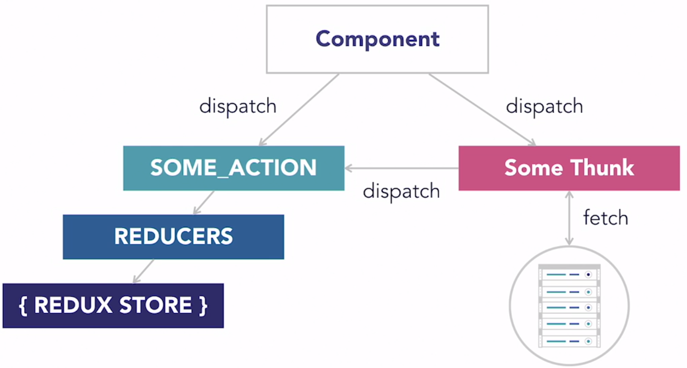
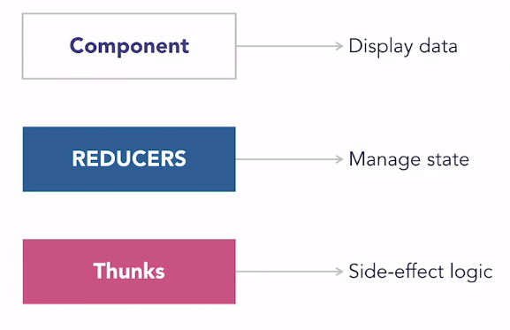
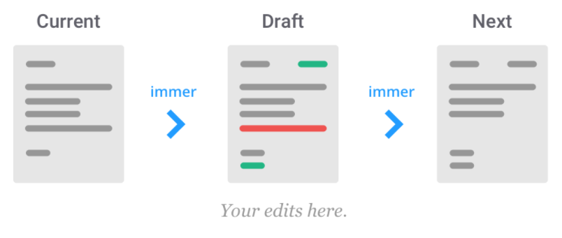

# Redux for React

Vanilla React creates modular performant user interface with components, and if seen from a MVC point of view, React is very well centered in the _View_ side of things, but doesn't really provide much guidance when it comes to _Model_ and _Controller_ side of things.

This is on purpose, to allow developers to make their own data management solutions.

The name of the game is: Separation of Concerns

- React Redux: manage state, using flux architecture.
- Redux Thunk: separate side-effects
- Reselect: abstract away the details of the state structure
- Styled Components: styling components and managing component appearance, specially when it depends on component state.

## Redux

_What's the best way to manage state?_
A Global state fixes the problems of:

- Props-drilling, passing down props from root great-grand-parent to great-grand-children
- Disconnected components that need a shared state

But suffers the problem of having no rules to access or interacting with state, leading to hard to debug problems.

Redux solves this problem by added rules and organization to a global state.

### How it works

Components are only allowed to interact with the global state by triggering a Redux action.
The global state can only be changed by the reducer and any expressions we define inside of it.
Unidirectional Data-flow: UI interaction > Action is triggered > Reducer updates state > Components get updated state > Another UI interaction...



1. One central global state: **The Store**, giant json object that holds all the application state, single source of truth.
   - For example, user object (name, bio, isLoggedIn), product array, article array, etc.
2. Actions: json objects consisting of **type** (usually a string naming the action) and **payload** (any additional data necessary).
   - The idea is to explicitely define the events that occur in our application, for example:
   - `USER_DATA_LOADED` could happen when the user logged in, and contains a payload with all the user data from the database.
   - `ITEM_ADDED_TO_CART` when the user clicks that button on the interface, and contains the item ID that the user just added to their cart as payload to be added to the `CART` object.
   - `MESSAGE_RECEIVED`, `MESSAGE_SENT`, `BUY_BUTTON_CLICKED`, `FILTER_APPLIED`
3. Reducers: specify what should happen to the global state when we receive X or Y action + payload.
   - `USER_DATA_LOADED`, the reducer would take the payload, and save it in the global state as an `user: {...}` object, for all components to access.
   - `ITEM_ADDED_TO_CART`, the reducer would take the payload (item ID) and concatenate it to the `shoppingCart: [...]` array of the user.

### Best Practices

1. Export both connected and unconnected version of your components
   - It is much easier to test components as-is instead of having to setup a fake store before using them.
   - Test shouldn't care if your component is connected or not, they simply want to test if the component is rendering the correct JS/HTML based on a particular set of props.

```javascript
export const TodoList = () => {...};
export default connect(...)(TodoList);
```

2. Reducer's only job is taking the current state, and combining it with an action to get an updated state

   - Never trigger async operations or any Redux action inside your reducers, only the bare minimun to get your state updated.

3. Think before connecting a component to the store
   - Connecting a component can make it less reusable if we want to use on another part of our application with different data
   - For example, a `TodoList` component could be used to show Completed todos and Incomplete todos, but if we connect it directly to store, then rendering two different `TodoList`s becomes more complex
   - Instead, life the state, connect the parent component, and let the parent divide the todos in two lists, and render two completely separate `TodoList`s

## Redux Thunk

Side-effect library like Redux Saga and Redux Logic.
The goal is separate side-effects from our components.

Redux thunk creates a fork in the unidirectional flow of data, where it captures the UI trigger action, executes the side-effect (e.g.: loading data from DB), and then it triggers a dispatch to continue the unidirectional flow.

So components can call thunks to do async operation, and then the thunk can call more thunks or call dispatch to update the global store.





## State Immutability

As usual, state must be treated as immutable. Any changes necessary must be applied to a new object that will substitute the state, but we never modify the state directly.

This can become a problem for multi-level nested objects, where you have to spread all the levels until you reach the property you want to change, and then return that new structure as the new state.

There are library to help with this problem, allowing you to "edit state directly" to avoid having to spread multiple levels (in reality they allow you to edit a proxy, and then they handle the deep object merge themselves).

### Immer

https://immerjs.github.io/immer/docs/introduction

Helpful [reminder on built-in Javascript APIs](https://immerjs.github.io/immer/docs/update-patterns) to update objects and arrays directly, you should only use these when you're not mutating the original object, for example, when using Immer.

Immer is one of those libraries, it allows you to work with immutable objects directly, while implementing a [_copy-on-write_](https://en.wikipedia.org/wiki/Copy-on-write 'copy-on-write') mechanism behind the scenes.

Immer exposes one important function, you can name it however you like, but it's traditionally imported as `produce` like `import produce from 'immer`.

We use that function to create a `draft` state (which is a proxy of the current state), and then `produce` generates the `newState` from our `draft`, if you don't make any changes to the `draft`, the original state is returned untouched.


_Using Immer is like having a personal assistant; he takes a letter (the current state) and gives you a copy (draft) to jot changes onto. Once you are done, the assistant will take your draft and produce the real immutable, final letter for you (the next state)._
