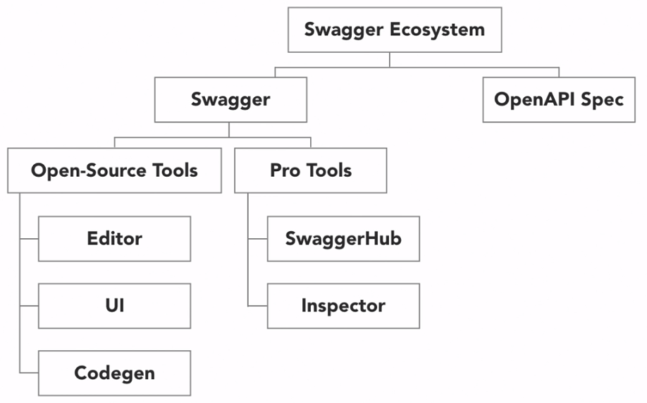
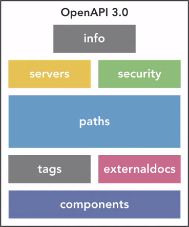
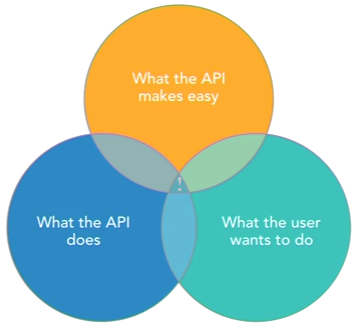

# Open API - Open Application Programming Interface

<https://github.com/OAI/OpenAPI-Specification>

Open API is a standard format for metadata used to define RESTful services. It defines standard, programming-language-agnostic interface description for REST APIs.

Swagger is a toolset and a structured approach for creating API designs, documentation, and code throughout the API lifecycle.

Other tools can build SDKs based on the Open API specification, and the Swagger structured approach.

Swagger began in 2010 as an open source tooling AND specification to provide interactive API documentation and SDK.

In 2015 is was acquired by SmartBear, who donated the specification portion to the Open API Initiative, who renamed the swagger specification to the Open API Specification.

Members of the Open API Initiative include Microsoft, Google, IBM, Paypal, and SmartBear.

## Swagger Toolbox

1. Editor: Create OpenAPI definitions
2. UI: Generate docs from API definitions
3. Codegen: Build client SDKs from API definitions

## Open API Interface

Exposes end-point or operations that clients can use to access API resources, via HTTP requests.

Some end-point might require the client to provide additional information with the request to properly invoke the operation.

Finally, API might send a response after certain requests.

The Open API Specification helps us document all the different implementation details involved in the API implementation, so that it can be understand by developers, while also being easy to programmatically consume.

## Benefits

1. Generate API documentation and Code
2. Ease integration with an API
3. Better developer experience
4. Facilitates collaboration between teams

## HTTP Verbs

1. GET: retrieve a resource or a collection of resources.
2. DELETE: delete a resource.
3. PUT: update an existing resource.
4. POST: Create a new resource.
   - Can be used for anything else that doesn't match the first three verbs

## Open API Specification

Seven sections at the root level, within these sections we can define various properties.

Only **info** and **path** sections are required, whoever, the **path** and **components** are the most important.

1. Info: General API information such as name and description, and other details like developer contact, license, and API version.
2. Servers: identifies the URL and description of the servers hosting the API. For example, showing Dev, UAT, and Prod servers.
3. Security: how the API is secured, specifying API keys, security cookies, and similar properties. It explains what is required from an authorization/authentication perspective to access the API resources.
4. Path: multiple paths/end-points that describe how to access resources on the API, and the different operations that can be performed. Requires the most information in the whole spec because it describes incoming and outgoing data requirements in detail from all paths/end-points
5. Tags: define tags to group APIs operations.
6. ExternalDocs: links to external resources about the API that are hosted elsewhere.
7. Components: common squema objects, parameter, request bodies, and response that may be used and re-used in multiple paths/end-points.

## Defining a RESTful API - Basics

Naming things well while simultaneously describing how to interact with those things.

What we need:

1. Decide what functionality to expose
2. Decide how to expose it
3. Decide best ways to expose it
4. Test and (in)validate assumptions
5. Repeat

Approaches:

1. Bolt-On Strategy: brute-force approach to add new functionality, fast but bad decisions generates problems
2. Greenfield Strategy: new system, complete freedom, API-first or mobile-first, hardest option due to having massive investment upfront before any benefits
3. Facade Strategy: replace business systems part by part, ideally for legacy systems, can be challenging due to multiple mind-sets

Modeling an API:

1. Don't worry about the tools
2. Have a consistent process
3. Involve the whole team: dev, qa, support.
4. Document everything: including assumptions and tasks. If it's not written down, it doesn't count, because you will forget.

Relationships:

1. Independent: this resource can exists on its own without any other resource.
   - Movies
2. Dependent: this resource can only exists if another resource already exits
   - Actors depend on movie
3. Associate: this resource can be dependent/independent, but needs additional information to fully describe it.
   - One actor plays multiple character
   - One character played by multiple actors

## Defining a RESTful API - Process

Be careful with system boundaries. Clearly identify who you are responsible for, and what are responsibilities of third-party components

Every specification has gaps, ambiguities, incomplete stories. Instead of guessing the solution, ask the product owner.

1. Identify Participants: entities involved in the business process who will use the API (person or machine), who/what initiates or awaits for an actions.
   1. Who are they?
   2. Internal or External?
   3. Active or passive?
   - For example, a coffee shop:
     1. The customer
     2. The barista
     3. The cashier
     4. ~~Other customer~~
     5. ~~Payment processor~~ not our responsibility here.
2. Identify Activities
   - Same coffee shop example:
     1. View coffee menu
     2. Add a coffee to cart
     3. ~~Add more items? Remove items?~~
     4. Checkout, pay for coffee
     5. Optional: cancel order
     6. Receive coffee
3. Break into Steps
   - Same coffee shop example:
     1. Customer places order with cashier
     2. Cashier passes order to barista
     3. Barista adds order to queue
     4. Cashier tells customer the total bill
     5. Customer provides payment (valid or not)
     6. If valid, barista makes order and delivers
4. Create API Definitions: using the participants, activities, and steps we defined before. Find your resources (the nouns!)
   1. Coffee: Independent, you want to view, add, edit coffees (**C**reate, **R**ead, **U**pdate)
   2. Cart: Dependent on coffee, collection of items (array)
   3. Order: Dependent on cart, a cart that has undergone the checkout process
   4. We probably will have many more nouns, for now we focus on the basics.
   - Our resources:
     1. List coffees | GET coffees
     2. View coffees | GET coffee
     3. Create a new cart | POST cart
     4. Add coffee to new cart | PUT cart
     5. View cart | GET cart
     6. Checkout (cart to order) | POST cart
     7. Create order | Done in the previous step
     8. List orders | GET orders
     9. View order | GET order
     10. Cancel orders | POST order (we are changing status to inactive, not deleting)
5. Validate your API
   1. Write documentation as if the API already existed (OpenAPI 3.0.0)
      - Don't make it perfect, make it clear and concise
      - Documentation doesn't mean the API is complete
      - Always keep it up-to-date as the API evolves
   2. Write pseudo-code as if the API existed to see if things make sense
   3. Use a micro-framework (hapi.js for Node) to validate incoming requests, verbs, URL patterns, HTTP response codes

## Defining a RESTful API - How APIs Work

1. HTTP is a protocol
2. XML is a markup language
3. JSON is a notation
4. XML standards add structure
5. JSON specifications add context
6. REST IS NONE OF THE ABOVE

REST is a generally agreed-upon set of principles and constrains, There's not always a right answers for everything.

### Headers and Response Code

| Response Codes | Meaning                                |
| -------------- | -------------------------------------- |
| **1XX**        | Informational                          |
| **2XX**        | Success                                |
| 200\*          | OK                                     |
| 201\*          | Created                                |
| 202            | Accepted (queueing)                    |
| 204\*          | No Content (after deleting a resource) |
| **3XX**        | Resourced moved - Redirect             |
| 301            | Moved permanently                      |
| 302            | Moved temporarily                      |
| **4XX**        | Client error                           |
| 400\*          | Bad Request                            |
| 401\*          | Auth required                          |
| 403\*          | Forbidden                              |
| 404\*          | Not found                              |
| 409\*          | Conflict                               |
| **5XX**        | Server error                           |

## RESTful API Constrains

1. Client-Server Arquitecture
2. Stateless Architecture: each and every request should be able to execute on its own.
   - In practice this means to send credentials with each request
   - This allows stability, scalable, reliable, flexibility
3. Cacheable: each message describes if and for how long it can be cached
   - Idempotency: every request can be executed 1 or N+1 times, and the resources on the server stay the same. GET, PUT, DELETE must be Idempotent, POST is a bit more difficult.
4. Layered Systems: component A might not communicate with component B.
   - There are many components between client and API, like DNS, load balancers, caching servers, logging, audit trails, authentication, authorization.
5. Code on demand:
6. Uniform interface:
   - Identify a resource, uniquely addressable
   - Manipulate resource through those identifications
   - Self-descriptive message
