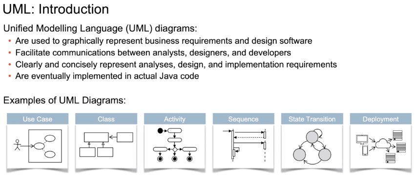
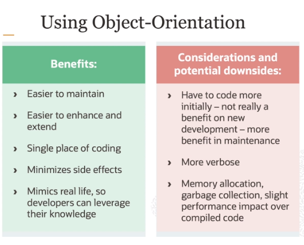
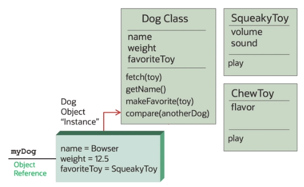

# Java Programming

- Web
- Mobile
- Server
- Desktop
- Embedded

Java Runtime Environment (JRE) needed to run Java programs
Java Development Kit (JDK) needed to build and develop Java programs, includes the JRE.

All Java code is inside a class.

## Data types

1. Primitives
   1. Boolean
   2. Int
   3. Double
   4. Char
2. Reference Types
   1. String
   2. Array

## Spring Definitions

1. POJO - Plain old Java object, true objects with state and behavior
2. Java Beans, simple objects with only getters and setters
3. Spring beans, POJOs configured in the application
4. DTO, Bean used to move state between layers

Inversion of Control in Spring
IoC Container: Mechanism for dependency injection
ApplicationContext: wraps the BeanFactory, which serves the beans to the runtime of the application
Spring Boot: provides auto-configuration of the ApplicationContext

## Spring Boot

- Supports rapid development
- Removes boilerplate of application setup
- Cloud native support, but also traditional

Key components:

- Embedded Tomcat
- Auto-config of ApplicationContext
- Automatic serlet mappings
- Embedded database support and hibernate/JPA dialect
- Automatic controller mappings

# Java Intro

- Each Java program is written and compiled once.
- No platform-specific changes are needed on the source-code.
  - It doesn't get compiled to machine code, instead it goes to an intermediate state: byte-code
  - Byte-code can be deployed and executed in any machine that can run the JVM.

## Ecosystem

- Java Card - sim-cards
- Java ME Micro Edition - Smart TVs, embedded devices, set-top boxes
- Java SE Standard Edition - JVM/JDK, compiler, libraries of useful classes
- Java MP Micro-Profile - microservices
- Java EE Enterprise-Edition - enterprise solutions

## Code Structure

- Class: basic unit of code, describes data and logic of your program.
  - Contain methods and variables
- Package: aggregation of classes, and their names reference a folder name in lower case.
- Module: aggregation of packages.
- Exception Handling: interrupt normal execution to run error-handlers.

## Mindset

- Classes and objects
  - Classes represent a type of thing or a concept with attributes and behaviors
  - Objects are instances of classes created at runtime.
- Code reuse through inheritance
  - Top level classes contain generic code to be reused by their descendants.
    - E.g.: Animal class with attributes like name, and behaviors like eat.
    - A descendant Dog class gets all the attributes and behaviors, and can extend those to include Bark behavior for example.
- Interface: abstract common behavior between different classes
- Enumerations: user defined constants
- Generics: pass specific type information to the compiler
- Interface: functions and subroutines that are exposed by an object.
- Method: reusable unit of logic:
  - `<access modifier> <return type> <method name> (<parameter list>) { /* method body and return statement */ }`

## Analysis, Design, and Architechture

1. Use Case Diagram: interaction between end user and the system
2. Class diagram: represent different classes and their behaviors, attributes and relationship between each-other.
3. Activity diagram: Flow of control
4. Sequence diagram: how one object can invoke another object and the passing of data back and forth
5. State transition diagram: document how object go in and out of certain states
6. Deployment Diagrams: how the application can be deployed.

## Java API

1. Arrays and Collections
   - Array is a simple group of elements with an index.
2. Collections: array lists, link lists, sets, stacks, queues
   - Can add, update, remove, search, rearrange.
3. Streams: filter, map and reduce large streams of data using lamda expressions
4. I/O: read/write information from/to various destinations
5. Concurrency: take advantage of multi-CPU-core architecture, execute code concurrently.
6. Persistence: Application logic > JPA > JDBC API (Neutral) > JDBC Driver (provider-specific) > Any Database
   - via the Java Database Connectivity protocol (JDBC) and
   - Java Persistence API (JPA) for object-relational mappings
     - Allows Java objects to be written to relational databases, and SQL data to be queried and parsed into new Java Objects

## Java Enterprise

1. Web Services: expose code for reuse in a controller, standardized manner.
   1. JAXB and JAXP APIs: Java object to XML mappings
   2. JSONP API: Java object to JSON mappings
   3. JAX-WS: SOAP implementation
   4. JAX-RS: REST implementation
2. Java EE Application server: runs the webservice we wrote on the server, e.g. TOMCAT is a Java EE server.
3. Enterprise Java Beans: reusable logic implmentation

## Object orientation

Simulating the real world in a computer.
Objects are _responsible_ for doing things, _collaborate_ with each-other, and use their _internal state_ to carry out _behaviors_.

We can ask a dog to sit, but we don't what the dog has to do to comprehend the command and sit, and we don't care, we just ask the dog to sit.

Similarly, in java objects, we hide implementation, so we can freely change it without breaking the users of the objects.

1. Class: template/factory for new object, design of an object
   1. Name of the class
   2. Body of the class:
      - Attributes and their types
      - Methods(parameters): return_types
2. Object: specific instance of a class at runtime.
   1. Has specific values for attributes
   2. Each object resides in memory and points to its Class definition
