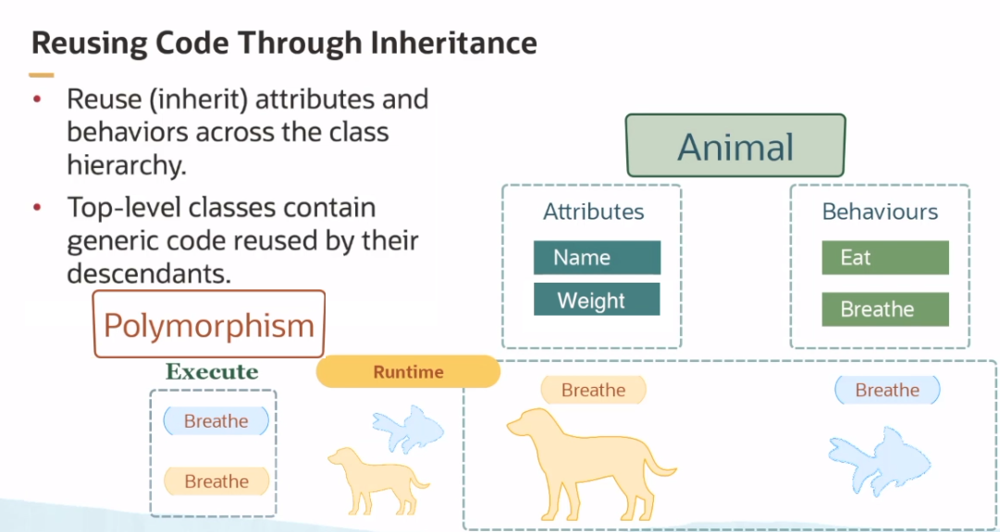

# Java Programming

- Web
- Mobile
- Server
- Desktop
- Embedded

Java Runtime Environment (JRE) needed to run Java programs
Java Development Kit (JDK) needed to build and develop Java programs, includes the JRE.

All Java code is inside a class.

## Data types

1. Primitives
   1. Boolean
   2. Int
   3. Double
   4. Char
2. Reference Types
   1. String
   2. Array

## Spring Definitions

1. POJO - Plain old Java object, true objects with state and behavior
2. Java Beans, simple objects with only getters and setters
3. Spring beans, POJOs configured in the application
4. DTO, Bean used to move state between layers

Inversion of Control in Spring
IoC Container: Mechanism for dependency injection
ApplicationContext: wraps the BeanFactory, which serves the beans to the runtime of the application
Spring Boot: provides auto-configuration of the ApplicationContext

## Spring Boot

- Supports rapid development
- Removes boilerplate of application setup
- Cloud native support, but also traditional

Key components:

- Embedded Tomcat
- Auto-config of ApplicationContext
- Automatic serlet mappings
- Embedded database support and hibernate/JPA dialect
- Automatic controller mappings

# Java Intro

- Each Java program is written and compiled once.
- No platform-specific changes are needed on the source-code.
  - It doesn't get compiled to machine code, instead it goes to an intermediate state: byte-code
  - Byte-code can be deployed and executed in any machine that can run the JVM.

## Ecosystem

- Java Card - sim-cards
- Java ME Micro Edition - Smart TVs, embedded devices, set-top boxes
- Java SE Standard Edition - JVM/JDK, compiler, libraries of useful classes
- Java MP Micro-Profile - microservices
- Java EE Enterprise-Edition - enterprise solutions

## Code Structure

- Class: basic unit of code, describes data and logic of your program.
  - Contain methods and variables
- Package: aggregation of classes, and their names reference a folder name in lower case.
- Module: aggregation of packages.
- Exception Handling: interrupt normal execution to run error-handlers.

## Mindset

- Classes and objects
  - Classes represent a type of thing or a concept with attributes and behaviors
  - Objects are instances of classes created at runtime.
- Code reuse through inheritance
  - Top level classes contain generic code to be reused by their descendants.
    - E.g.: Animal class with attributes like name, and behaviors like eat.
    - A descendant Dog class gets all the attributes and behaviors, and can extend those to include Bark behavior for example.
- Interface: abstract common behavior between different classes
- Enumerations: user defined constants
- Generics: pass specific type information to the compiler
- Interface: functions and subroutines that are exposed by an object.
- Method: reusable unit of logic:
  - `<access modifier> <return type> <method name> (<parameter list>) { /* method body and return statement */ }`

